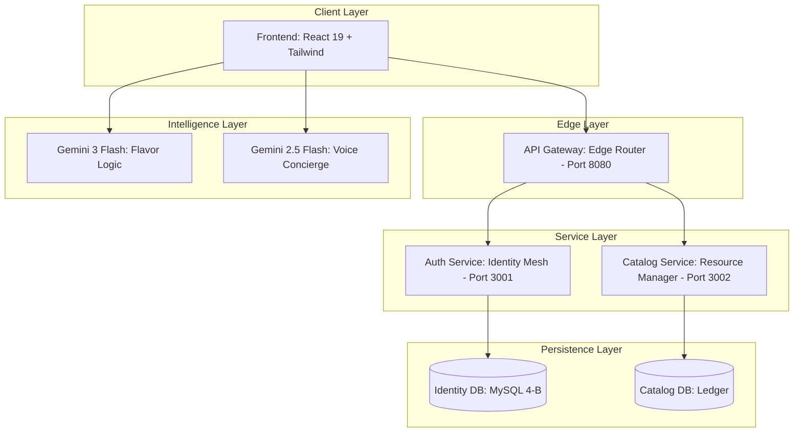
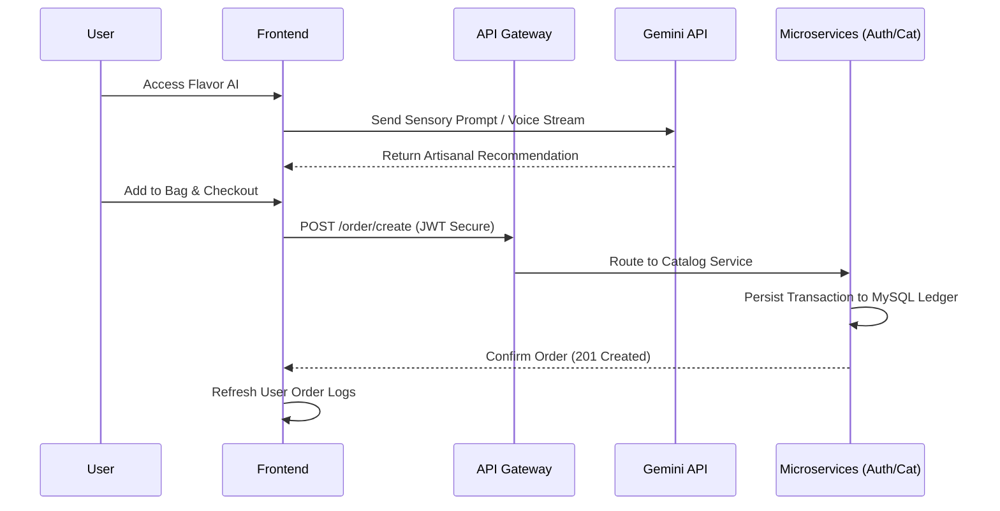

# 🍦 Glacier AI: Premium Sensory Ice Cream Boutique

Glacier AI is a high-end, microservices-architected digital storefront that redefines the artisanal ice cream experience. By blending sophisticated UI design with state-of-the-art Generative AI (Gemini 3.0 & 2.5), it offers customers a personalized "Sensory Consultation" via both neural text processing and real-time voice interaction.

---

## 🏗️ System Architecture

The application is built on a **Microservice Mesh** pattern, ensuring separation of concerns between identity management, resource handling, and AI orchestration.

### 📊 Architecture Diagram



---

## 🔄 Service & Data Flow

Glacier AI synchronizes AI-driven discovery with a persistent transactional ledger to ensure a seamless user journey.

### 🌊 Flow Diagram



---

## 🚀 Getting Started

### Prerequisites
- **Node.js** (v18+)
- **Docker & Docker Compose** (for containerized deployment)
- **Gemini API Key**: Obtain from [Google AI Studio](https://aistudio.google.com/)

---

### 💻 Local Development Build

1. **Clone & Install**
   ```bash
   npm install
   ```

2. **Configure Environment**
   Set your API key in your terminal session:
   ```bash
   # Windows (Command Prompt)
   set API_KEY=your_gemini_key_here
   
   # Linux/macOS
   export API_KEY=your_gemini_key_here
   ```

3. **Launch Development Server**
   ```bash
   npm run dev
   ```
   The app will be available at `http://localhost:5173`. The frontend is pre-configured to point to `localhost:8080` for gateway services when running in dev mode.

---

### 🐳 Docker Production Build

For a production-grade deployment (e.g., AWS EC2, DigitalOcean), use the orchestrated container mesh.

1. **Build and Launch**
   Run the entire mesh (Frontend, Gateway, Auth, Catalog) in detached mode:
   ```bash
   API_KEY=your_gemini_key_here docker-compose up --build -d
   ```

2. **Verify Services**
   - **Frontend**: Accessible on port `80`
   - **API Gateway**: Accessible on port `8080`
   - **Catalog Health**: Check `http://<ip>:8080/product/list`

3. **Shutdown**
   ```bash
   docker-compose down
   ```

---

## 🛠️ Tech Stack & Features

| Layer | Technology | Key Feature |
| :--- | :--- | :--- |
| **Frontend** | React 19, Tailwind CSS | Atomic components, glassmorphism UI |
| **AI Orchestration** | Gemini 3 Flash / 2.5 Flash Native Audio | Real-time PCM streaming, JSON schema grounding |
| **Backend** | Node.js, API Gateway Pattern | Dynamic path-based routing, service normalization |
| **Persistence** | Versioned MySQL (Simulated) | Order ledger preservation, identity archival |
| **Deployment** | Docker, Nginx Multi-stage | Optimized production footprint, auto-healing |

---

## 🛡️ Reliability & Security
- **JWT-Style Handshakes**: All sensitive routes are verified via the Gateway before hitting internal service nodes.
- **Microservice Isolation**: The Auth and Catalog services operate on independent internal ports, accessible only via the Gateway.
- **Auto-Sync Identity**: User order logs are automatically reconciled across the mesh upon login/checkout.

---
*Created by Glacier AI Engineering - Pioneering the future of artisanal taste.*